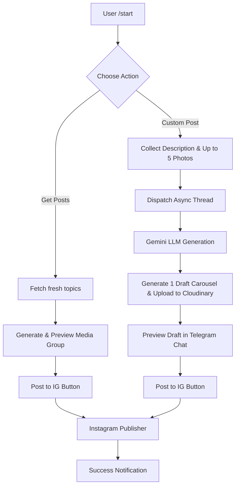

# ArxivIntel Telegram Bot

An autonomous and interactive Telegram bot to manage the ArxivIntel Instagram content pipeline.

## Features
- **Get Posts**: Fetch fresh topics from rotation sources (RSS, HF, Google Trends), preview them as media groups, and publish any of them with one click.
- **Custom Post**: User can provide a description and up to 5 photos. The system uses Gemini (Multimodal) to generate a professional caption and a new image generation prompt to create high-quality editorial drafts.
- **Asynchronous Execution & Fast Response**: Custom post generation can take up to 2-3 minutes due to Gemini and Cloudinary bottlenecks. The bot natively handles these tasks in a background thread to stay fully responsive!
- **Ghost-Safe Publishing**: All publication requests from the bot use the same jitter and safety checks as the automated scheduler to avoid platform bans.

## Configuration (.env)
Add the following to your `.env` file:
```env
TELEGRAM_BOT_TOKEN=your_bot_token
TELEGRAM_CHAT_ID=your_chat_id
BOT_MODE=polling  # or 'webhook' for production
WEBHOOK_URL=https://your-domain.com  # only required for webhook mode

# Optimize Image Speed: Generate 1 draft of 5 images instead of 2 drafts (10 images)
CUSTOM_POST_DRAFT_COUNT=1
```

## How to Run
### Local Development (Polling)
1. Ensure `BOT_MODE=polling` in `.env`.
2. Install dependencies:
   ```bash
   pip install python-telegram-bot python-dotenv cloudinary httpx
   ```
3. Run the bot:
   ```bash
   python -m src.bot.telegram_bot
   ```

### Production (Webhook)
1. Ensure `BOT_MODE=webhook` and `WEBHOOK_URL` is set.
2. The bot will automatically register the webhook on startup.
3. Run with a process manager like PM2 or Docker.

## Flow Diagram

